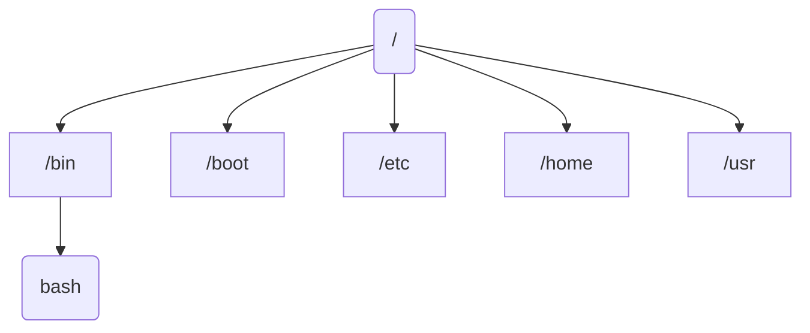

# Overview
Linux kernel maintains a single hierarchical directory structure to organise **all files** - unlike on windows, a separate disk device has its own directory hierarchy.

The base of a linux hierarchy is the root `/`, all files and directories are children or further descendants of the root directory. The most notable ones are:

Directories are a special file whose content take the form of a table of filenames coupled with references to the corresponding files. This `filename -> reference` association / mapping is referred to as a **link**.

Every directory contains at least two entries - `.` (dot) and `..` (two dots) - these are the link to self and link to parent respectively.

**Symbolic Link** is another type of link. It is a specially marked file containing the name of another file - `symbolic_link -> target_file`, just like a pointer. When the pathname to this symbolic link is used in the system call, the kernel automatically dereferences to retrieve the target file, replacing it with the `target_file` it points.

Each file also has an associated user and group ID. This ownership is used to determine the access rights available to users of the file. The system divides users into three groups
1. owner - who created the file
2. group - users who have matching group ID as the file
3. other - all other users
The above also applies to directories, since they are just a special type of file.
