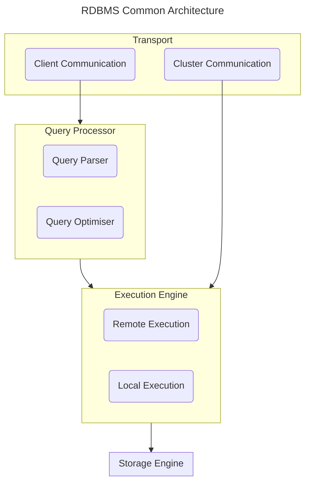

Most relational databases share the following architecture.

Most DBMS uses client-server model, where the database instances (nodes) play the role of the server, and the application instances take the role of the clients.

Client requests arrive through the transport subsystem in the form of queries. The transport system may also be responsible for communication with other nodes in the database cluster, as seen in [distributed databases](Distributed%20Databases).

Next, the query reaches the query processor, which parses and optimises a query, in order to find the most efficient way to execute it based on internal statistics. 

The query is usually presented as an execution plan: a sequence of operations that have to be carried out for its results to be considered complete. The same query can be satisfied by various execution plan, hence the query optimiser needs to pick the best available plan.

The chosen plan is then executed by the execution engine. It may also trigger remote execution - reading and writing data to and from other nodes in the cluster, and replication. The local queries are then executed by the storage engine.

The storage engine is a big component comprising of the following modules
1. Transaction Manager - schedules transaction to ensure database remain in a consistent state
2. Lock Manager - ensuring operation satisfy [concurrent safety constraints](Concurrency%20Control%20in%20RDBMS.md)
3. Access Methods - access and organises data on disk
4. Buffer Manager - caches data pages in memory
5. Recovery Manager - maintains the operation log and restore the system in case of a failure

The storage engine is important in providing access to efficient data structures, such as . It is also responsible for [transaction processing and recovery](Transaction%20Processing%20and%20Recovery.md).
