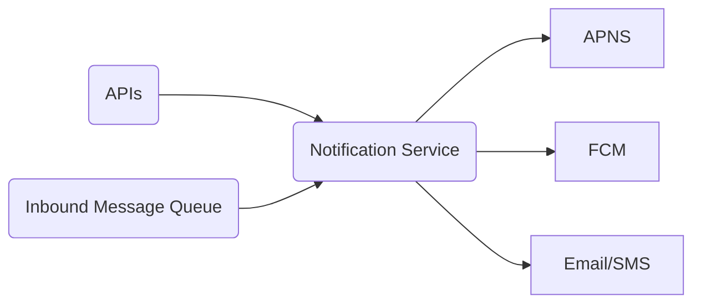
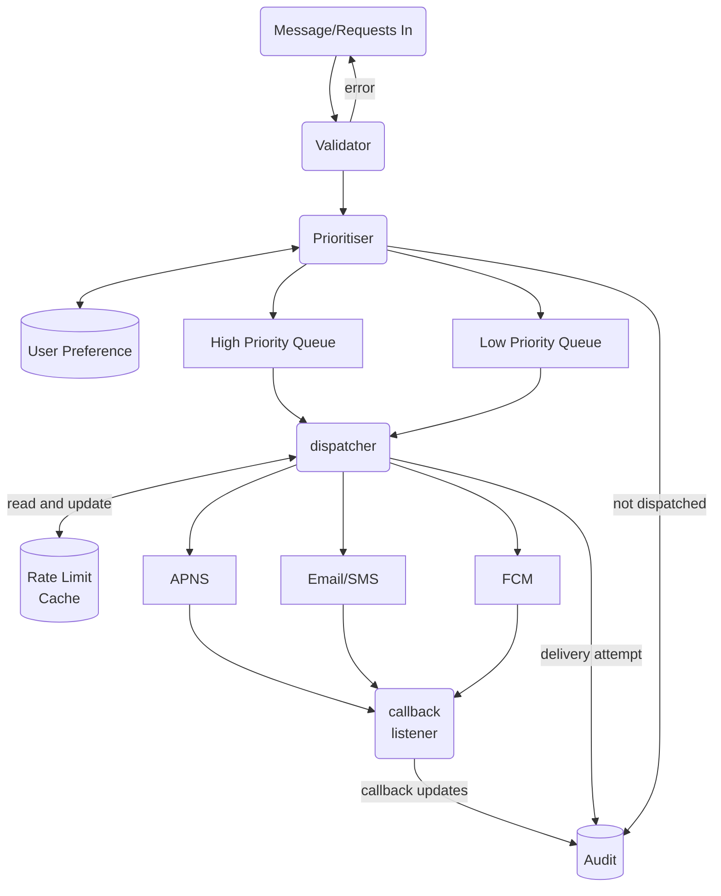

# Case Study
1. personalised and tailored push notifications are more effective
2. notifications are positive multiplier, they work best when a user is already spending much time on the application
# Requirements
1. The system must be able to send notifications
2. Pluggable, the system should allow new notification types to be added / removed easily
3. Ability to handle large number of receiving clients
4. [Rate limit](Rate%20Limiting) across topics to avoid overwhelming recipients
5. Allows topic prioritisation, for example, transactional messages such as OTP should be delivered first. 
6. Allows receiving user to set preferences, such as not receive, or receive via SMS/Email
# Key Components
### Platform Specific Notification Services
The big players here are Apple Push Notification Service and Firebase Cloud Messaging (APNS and FCM). They generally work via the following steps
1. Device registration, providing the notification service a device code as identifier
2. The above identifier is made available to the developer's application backend (us)
3. Application backend / server can decide to send messages to the notification service along with the registration token or topic
4. Upon receiving, the notification service delivers the intended notification to device
### User Subsystem
We have to track the user's notification preferences in the backend, with a preference, or settings database. We want to honour user's preference before sending out notifications.

We may also have persistent storage to track user behaviour to tailor the input.
### Notification Rate Limiter & Prioritiser
We allow services to trigger notification to be sent to user. It's important to place proper rate limit to avoid runaway processes from flooding the users with notifications.

A unintentional overlap of multiple services publishing notifications may also caused undesired notification spike, service rate limiter would not be able to prevent this. Hence, the rate limiter also applies to user devices, to avoid a device from getting too many notifications at once.\

With rate limiting comes back off, some notification may be halted in the pipeline. We also need to provide adequate notification prioritisation, to allow some messages to be sent in priority, or to be sent even when a device / service is rate limited.
### Notification Audit
We want to track all notifications we have sent to platform notification services. Although the platform notification services are usually best effort (APNS, email, FCM).

# Simple Design
The notification system can have to main interfaces
1. interface to receive notification events which trigger a notification sending process
2. interface with service providers such as APNS and SMTP, who the system uses to send out notification to devices

The bulk of the complexity lies within the system, on how it handles a notification sending process.

First, we want to validate, rate limit and prioritise the incoming API calls and messages. Incoming request / queue message will be processed by `Notification Validator`.

Next, based on the validity and priority of the notification, the `Notification Validator` may dispatch the request based on different priorities after checking user preferences.

Before a notification is eventually sent to the user, we would do the following
1. check against user device rate limiting, or other filters such as email bounce lists
2. insert an attempt to audit database

Now, we can make a call to best-effort notification services. In case of unexpected failure, the dispatcher will perform exponentially back off retries. 

We will do the following steps as post processing steps
1. listen for any asynchronous results, and update the recorded attempt in the database
2. update user device rate limit

